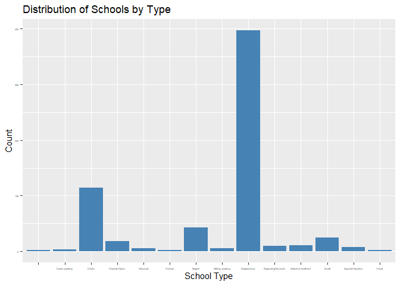
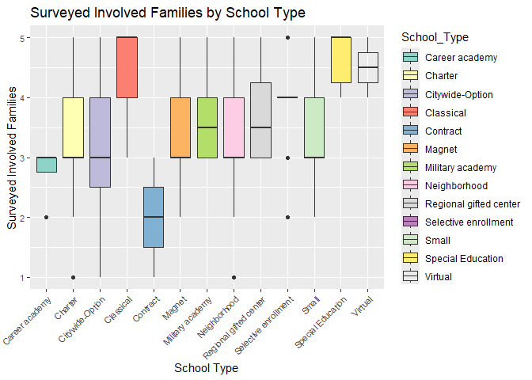
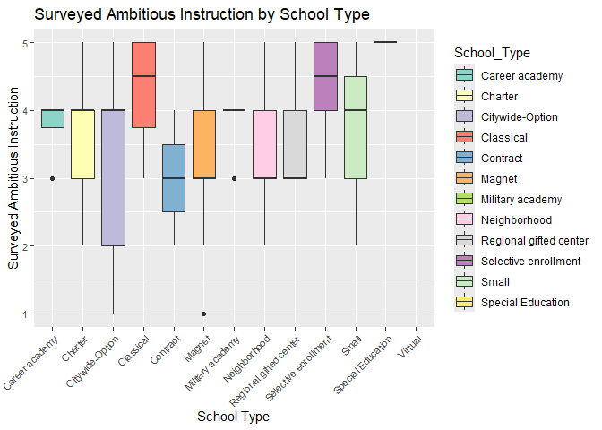

Chicago Public Schools - Education and Performance Analysis
================
Team Members: Keenan Jacobs and Jack Larson

### Intro

The goal of our project is to explore the data set to better understand
how various metrics affect schools in Chicago Public Schools. We looked
at SAT performance, attainment levels across grades, growth in specific
subjects (Math and Reading), and other indicators related to school
type, demographics, and resources

What we are looking for:

1.  What factors affect SAT performance, attainment levels, and growth?

2.  What percentage of schools have an attainment above a 50%?

3.  How does school type affect student performance in SAT Math and
    Reading?

4.  What are the key factors that contribute to higher SAT attainment
    rates across all grades?

5.  How do perceptions of school climate and environment, as captured by
    survey ratings, relate to student outcomes such as SAT performance
    and attendance?

### Data

The link to the data is
<https://data.cityofchicago.org/Education/Chicago-Public-Schools-School-Progress-Reports-SY2/2dn2-x66j/about_data>.
The website contains a CSV file that can be downloaded that has info
about all public schools in Chicago from the year 2023-2024. It includes
650 schools/rows and a total of 182 variables. It includes various
factors like - student growth rating, student attainment rating, SAT
reading and math scores, school surveys, etc.

### First Data Cleaning Steps

To prepare the data for analysis, we begin by loading the dataset,
removing irrelevant or duplicated columns, and handling missing values.
Below is the code for the initial data cleaning process:

``` r
# Load necessary libraries
library(tidyverse)
```

    ## ── Attaching core tidyverse packages ──────────────────────── tidyverse 2.0.0 ──
    ## ✔ dplyr     1.1.4     ✔ readr     2.1.5
    ## ✔ forcats   1.0.0     ✔ stringr   1.5.1
    ## ✔ ggplot2   3.5.1     ✔ tibble    3.2.1
    ## ✔ lubridate 1.9.3     ✔ tidyr     1.3.1
    ## ✔ purrr     1.0.2     
    ## ── Conflicts ────────────────────────────────────────── tidyverse_conflicts() ──
    ## ✖ dplyr::filter() masks stats::filter()
    ## ✖ dplyr::lag()    masks stats::lag()
    ## ℹ Use the conflicted package (<http://conflicted.r-lib.org/>) to force all conflicts to become errors

``` r
library(knitr)

data <- read.csv("Chicago_Public_Schools_-_School_Progress_Reports_SY2324.csv")

missing_data <- data %>%
  summarize_all(~mean(is.na(.)))

cleaned_data <- data %>%
  select(-c(School_ID, Address, City, State, Zip, Phone))

head(cleaned_data[, 1:5], 5)
```

    ##     Short_Name                       Long_Name  School_Type Primary_Category
    ## 1         RUIZ   Irma C Ruiz Elementary School Neighborhood               ES
    ## 2 ROOSEVELT HS  Theodore Roosevelt High School Neighborhood               HS
    ## 3        LLOYD Henry D Lloyd Elementary School Neighborhood               ES
    ## 4       HEDGES  James Hedges Elementary School Neighborhood               ES
    ## 5     WHISTLER John Whistler Elementary School Neighborhood               ES
    ##            Fax
    ## 1 773-535-4618
    ## 2 773-534-5044
    ## 3 773-534-3388
    ## 4 773-535-4178
    ## 5 773-535-5589

# Dataset Description

# General School Information

*School_ID: Unique identifier for each school *Short_Name, Long_Name:
Short and full names of the school *School_Type: Type/category of school
(e.g., Charter, Magnet, Neighborhood) *Primary_Category: Main category
the school falls under \*School_Latitude, School_Longitude: Geographic
coordinates of the school

# Academic Growth and Attainment Metrics

*Growth_Reading_Grades_Tested_Pct_ES: Percent growth in reading for
tested grades (Elementary School)
*Growth_Reading_Grades_Tested_Label_ES: Label for reading growth
performance *Growth_Math_Grades_Tested_Pct_ES: Percent growth in math
for tested grades *Growth_Math_Grades_Tested_Label_ES: Label for math
growth performance *Attainment_Reading_Pct_ES,
Attainment_Reading_Lbl_ES: Reading attainment percentage and label
*Attainment_Math_Pct_ES, Attainment_Math_Lbl_ES: Math attainment
percentage and label \*NWEA_Reading_Growth_Grade\_(3-8)*Pct,
NWEA_Math_Growth_Grade*(3-8)\_Pct: Growth percentages for NWEA tests
(Grades 3-8) *PSAT_Grade_9_Score_School_Avg,
PSAT_Grade_10_Score_School_Avg: Average PSAT scores for Grades 9 and 10
*SAT_Grade_11_Score_School_Avg, SAT_Grade_11_Score_CPS_Avg: Average SAT
scores for Grade 11 (school and CPS average) *Growth_PSAT and Growth_SAT
Metrics: Growth percentages for PSAT and SAT Reading and Math
*Attainment_PSAT and Attainment_SAT Metrics: Attainment percentages for
PSAT and SAT Reading and Math

# Graduation and College Outcomes

*Graduation_4_Year_School_Pct_Year_X: 4-year graduation rate for school
*Graduation_5_Year_School_Pct_Year_X: 5-year graduation rate for school
*College_Enrollment_School_Pct_Year_X: Percentage of students enrolled
in college *College_Persistence_School_Pct_Year_X: Percentage of
students persisting in college

# School Culture and Climate

*Culture_Climate_Rating: Overall rating of school culture and climate
*Culture_Climate_Description: Descriptive summary of school climate
*School_Survey_Involved_Families: Survey results for family involvement
*School_Survey_Supportive_Environment: Survey results for supportive
environment *School_Survey_Ambitious_Instruction: Survey results for
ambitious instruction *School_Survey_Effective_Leaders: Survey results
for effective leadership *School_Survey_Collaborative_Teachers: Results
for teacher collaboration *School_Survey_Parent_Teacher_Partnership:
Partnership between parents and teachers
\*School_Survey_Quality_Of_Facilities: Perception of school facilities

*Attendance and Truancy *Chronic_Truancy_Pct: Percentage of chronically
truant students ————————————————————————–

### Marginal Summaries

Here we will look at a few of the peripherals regarding our dataset.
Specifically, we will take a look at the number of schools and how much
of our data has missing or no values

#### School Type Distribution: Count the number of schools by type

This code calculates the total number of schools for each school type in
the dataset, providing a breakdown of the distribution by type.

``` r
# 1. Count of schools by school type
school_type_distribution <- cleaned_data %>%
  count(School_Type)

# Print results as a markdown table
print(knitr::kable(school_type_distribution, format = "markdown"))
```

    ## 
    ## 
    ## |School_Type            |   n|
    ## |:----------------------|---:|
    ## |                       |   2|
    ## |Career academy         |   4|
    ## |Charter                | 114|
    ## |Citywide-Option        |  19|
    ## |Classical              |   6|
    ## |Contract               |   3|
    ## |Magnet                 |  43|
    ## |Military academy       |   6|
    ## |Neighborhood           | 397|
    ## |Regional gifted center |  10|
    ## |Selective enrollment   |  11|
    ## |Small                  |  25|
    ## |Special Education      |   8|
    ## |Virtual                |   2|

#### Count Entries with More Than 50% of Columns Filled with Valid Data

This code calculates the total number of rows in the dataset, counts the
entries where more than 50% of numeric columns have valid data (non-NA
and non-zero), and computes the percentage of such valid entries
relative to the total.

``` r
# Count rows where more than 50% of numeric columns are filled with non-NA and non-zero data
# Total number of entries in the dataset
total_entries <- nrow(cleaned_data)

# Count rows where more than 50% of numeric columns are filled with non-NA and non-zero data
entries_with_valid_data <- cleaned_data %>%
  select(where(is.numeric)) %>%  # Consider only numeric columns
  rowwise() %>%
  mutate(valid_data_fraction = mean(!is.na(c_across(everything())) & c_across(everything()) != 0)) %>%
  filter(valid_data_fraction > 0.5) %>%
  nrow()

# Calculate the percentage of valid entries
percentage_valid_data <- (entries_with_valid_data / total_entries) * 100

# Display the results
list(
  Total_Entries = total_entries,
  Valid_Entries = entries_with_valid_data,
  Percentage_Valid_Entries = percentage_valid_data
)
```

    ## $Total_Entries
    ## [1] 650
    ## 
    ## $Valid_Entries
    ## [1] 150
    ## 
    ## $Percentage_Valid_Entries
    ## [1] 23.07692

#### Count Number of Invalid Entries for Each Colum

This code identifies columns in the dataset where all entries are either
missing (NA) or zero and displays them in a table.

``` r
# Count the number of invalid (NA, zero) entries for each column
columns_with_no_data <- cleaned_data %>%
  summarize_all(~ sum(is.na(.) | . == 0)) %>%
  pivot_longer(cols = everything(), names_to = "Column", values_to = "Missing_or_Zero_Count") %>%
  filter(Missing_or_Zero_Count == nrow(cleaned_data)) 

# Print results as a markdown table
print(knitr::kable(columns_with_no_data, format = "markdown", caption = "Columns with No Valid Data (All Entries NA or Zero)"))
```

    ## 
    ## 
    ## Table: Columns with No Valid Data (All Entries NA or Zero)
    ## 
    ## |Column                                     | Missing_or_Zero_Count|
    ## |:------------------------------------------|---------------------:|
    ## |Growth_Reading_Grades_Tested_Pct_ES        |                   650|
    ## |Growth_Reading_Grades_Tested_Label_ES      |                   650|
    ## |Growth_Math_Grades_Tested_Pct_ES           |                   650|
    ## |Growth_Math_Grades_Tested_Label_ES         |                   650|
    ## |Attainment_Reading_Pct_ES                  |                   650|
    ## |Attainment_Reading_Lbl_ES                  |                   650|
    ## |Attainment_Math_Pct_ES                     |                   650|
    ## |Attainment_Math_Lbl_ES                     |                   650|
    ## |School_Survey_Parent_Response_Rate_Pct     |                   650|
    ## |School_Survey_Parent_Response_Rate_Avg_Pct |                   650|
    ## |NWEA_Reading_Growth_Grade_3_Pct            |                   650|
    ## |NWEA_Reading_Growth_Grade_3_Lbl            |                   650|
    ## |NWEA_Reading_Growth_Grade_4_Pct            |                   650|
    ## |NWEA_Reading_Growth_Grade_4_Lbl            |                   650|
    ## |NWEA_Reading_Growth_Grade_5_Pct            |                   650|
    ## |NWEA_Reading_Growth_Grade_5_Lbl            |                   650|
    ## |NWEA_Reading_Growth_Grade_6_Pct            |                   650|
    ## |NWEA_Reading_Growth_Grade_6_Lbl            |                   650|
    ## |NWEA_Reading_Growth_Grade_7_Pct            |                   650|
    ## |NWEA_Reading_Growth_Grade_7_Lbl            |                   650|
    ## |NWEA_Reading_Growth_Grade_8_Pct            |                   650|
    ## |NWEA_Reading_Growth_Grade_8_Lbl            |                   650|
    ## |NWEA_Math_Growth_Grade_3_Pct               |                   650|
    ## |NWEA_Math_Growth_Grade_3_Lbl               |                   650|
    ## |NWEA_Math_Growth_Grade_4_Pct               |                   650|
    ## |NWEA_Math_Growth_Grade_4_Lbl               |                   650|
    ## |NWEA_Math_Growth_Grade_5_Pct               |                   650|
    ## |NWEA_Math_Growth_Grade_5_Lbl               |                   650|
    ## |NWEA_Math_Growth_Grade_6_Pct               |                   650|
    ## |NWEA_Math_Growth_Grade_6_Lbl               |                   650|
    ## |NWEA_Math_Growth_Grade_7_Pct               |                   650|
    ## |NWEA_Math_Growth_Grade_7_Lbl               |                   650|
    ## |NWEA_Math_Growth_Grade_8_Pct               |                   650|
    ## |NWEA_Math_Growth_Grade_8_Lbl               |                   650|
    ## |NWEA_Reading_Attainment_Grade_2_Pct        |                   650|
    ## |NWEA_Reading_Attainment_Grade_2_Lbl        |                   650|
    ## |NWEA_Reading_Attainment_Grade_3_Pct        |                   650|
    ## |NWEA_Reading_Attainment_Grade_3_Lbl        |                   650|
    ## |NWEA_Reading_Attainment_Grade_4_Pct        |                   650|
    ## |NWEA_Reading_Attainment_Grade_4_Lbl        |                   650|
    ## |NWEA_Reading_Attainment_Grade_5_Pct        |                   650|
    ## |NWEA_Reading_Attainment_Grade_5_Lbl        |                   650|
    ## |NWEA_Reading_Attainment_Grade_6_Pct        |                   650|
    ## |NWEA_Reading_Attainment_Grade_6_Lbl        |                   650|
    ## |NWEA_Reading_Attainment_Grade_7_Pct        |                   650|
    ## |NWEA_Reading_Attainment_Grade_7_Lbl        |                   650|
    ## |NWEA_Reading_Attainment_Grade_8_Pct        |                   650|
    ## |NWEA_Reading_Attainment_Grade_8_Lbl        |                   650|
    ## |NWEA_Math_Attainment_Grade_2_Pct           |                   650|
    ## |NWEA_Math_Attainment_Grade_2_Lbl           |                   650|
    ## |NWEA_Math_Attainment_Grade_3_Pct           |                   650|
    ## |NWEA_Math_Attainment_Grade_3_Lbl           |                   650|
    ## |NWEA_Math_Attainment_Grade_4_Pct           |                   650|
    ## |NWEA_Math_Attainment_Grade_4_Lbl           |                   650|
    ## |NWEA_Math_Attainment_Grade_5_Pct           |                   650|
    ## |NWEA_Math_Attainment_Grade_5_Lbl           |                   650|
    ## |NWEA_Math_Attainment_Grade_6_Pct           |                   650|
    ## |NWEA_Math_Attainment_Grade_6_Lbl           |                   650|
    ## |NWEA_Math_Attainment_Grade_7_Pct           |                   650|
    ## |NWEA_Math_Attainment_Grade_7_Lbl           |                   650|
    ## |NWEA_Math_Attainment_Grade_8_Pct           |                   650|
    ## |NWEA_Math_Attainment_Grade_8_Lbl           |                   650|
    ## |School_Survey_School_Community             |                   650|
    ## |School_Survey_Parent_Teacher_Partnership   |                   650|
    ## |School_Survey_Quality_Of_Facilities        |                   650|
    ## |School_Survey_Rating_Description           |                   650|
    ## |PSAT_Grade_9_Score_School_Avg              |                   650|
    ## |PSAT_Grade_10_Score_School_Avg             |                   650|
    ## |Growth_PSAT_Grade_9_School_Pct             |                   650|
    ## |Growth_PSAT_Grade_9_School_Lbl             |                   650|
    ## |Growth_PSAT_Reading_Grade_10_School_Pct    |                   650|
    ## |Growth_PSAT_Reading_Grade_10_School_Lbl    |                   650|
    ## |Growth_SAT_Grade_11_School_Pct             |                   650|
    ## |Growth_SAT_Grade_11_School_Lbl             |                   650|
    ## |Growth_PSAT_Math_Grade_10_School_Pct       |                   650|
    ## |Growth_PSAT_Math_Grade_10_School_Lbl       |                   650|
    ## |Growth_SAT_Reading_Grade_11_School_Pct     |                   650|
    ## |Growth_SAT_Reading_Grade_11_School_Lbl     |                   650|
    ## |Growth_SAT_Math_Grade_11_School_Pct        |                   650|
    ## |Growth_SAT_Math_Grade_11_School_Lbl        |                   650|

#### Marginal Summaries Conclusion

- The majority of schools in the dataset are neighborhood schools,
  highlighting their prevalence in the dataset.
- Only a subset of entries (where more than 50% of numeric columns have
  valid data) are usable, indicating data completeness challenges.
- Several columns in the dataset contain entirely invalid data (all
  entries are either NA or zero), suggesting these fields may be
  unsuitable for analysis.
- The presence of incomplete data emphasizes the need for careful
  preprocessing to focus on reliable metrics for meaningful insights.

------------------------------------------------------------------------

### Exploring the Data

To gain a better understanding of the factors affecting student
performance, we begin by exploring how school type influences SAT Math
and Reading scores.

### What is the Percentage of Schools with Attainment Above a Threshold: For example, the percentage of schools with attainment rates above 50%?

This code filters out schools with missing or zero attainment rates to
ensure accurate calculations. It then summarizes attainment statistics
by school type (mean, median, standard deviation, and count) and
calculates the percentage of schools with attainment rates above 50%.

``` r
# Filter out schools with N/A or 0 for attainment rate
valid_attainment_data <- cleaned_data %>%
  filter(!is.na(Attainment_All_Grades_School_Pct) & Attainment_All_Grades_School_Pct > 0)

# 2. Summary of attainment by school type
attainment_summary_by_school_type <- valid_attainment_data %>%
  group_by(School_Type) %>%
  summarize(
    mean_attainment_all_grades = mean(Attainment_All_Grades_School_Pct, na.rm = TRUE),
    median_attainment_all_grades = median(Attainment_All_Grades_School_Pct, na.rm = TRUE),
    sd_attainment_all_grades = sd(Attainment_All_Grades_School_Pct, na.rm = TRUE),
    count = n()
  )

# Print summary table as markdown
print(knitr::kable(attainment_summary_by_school_type, format = "markdown", caption = "Summary of Attainment by School Type"))
```

    ## 
    ## 
    ## Table: Summary of Attainment by School Type
    ## 
    ## |School_Type          | mean_attainment_all_grades| median_attainment_all_grades| sd_attainment_all_grades| count|
    ## |:--------------------|--------------------------:|----------------------------:|------------------------:|-----:|
    ## |Career academy       |                  10.600000|                         5.40|                12.502000|     4|
    ## |Charter              |                  15.263830|                        12.80|                 9.542751|    47|
    ## |Citywide-Option      |                   7.958333|                         6.90|                 4.534807|    12|
    ## |Contract             |                  22.950000|                        22.95|                24.819448|     2|
    ## |Magnet               |                  32.328571|                        32.50|                20.732560|     7|
    ## |Military academy     |                  20.650000|                        19.85|                 7.445468|     6|
    ## |Neighborhood         |                  17.758139|                        10.40|                16.766523|    43|
    ## |Selective enrollment |                  74.845455|                        83.80|                27.310268|    11|
    ## |Small                |                  13.492308|                        11.60|                12.791499|    13|

``` r
# 3. Percentage of schools with attainment above 50%
percent_above_50_attainment <- valid_attainment_data %>%
  summarize(
    percent_above_50 = mean(Attainment_All_Grades_School_Pct > 50) * 100
  )

# Print percentage table as markdown
print(knitr::kable(percent_above_50_attainment, format = "markdown", caption = "Percentage of Schools with Attainment Above 50%"))
```

    ## 
    ## 
    ## Table: Percentage of Schools with Attainment Above 50%
    ## 
    ## | percent_above_50|
    ## |----------------:|
    ## |         8.965517|

**Conclusion** - Selective enrollment schools exhibit the highest
attainment rates among school types. - Only 8.97% of schools achieve
attainment rates above 50%, highlighting challenges in district-wide
academic performance.

------------------------------------------------------------------------

#### How does school type (e.g., neighborhood vs. charter) affect student performance in SAT Math and Reading?

This code filters schools with valid SAT scores and calculates summary
statistics (mean, median, SD) by school type. It also generates a bar
chart showing average SAT scores by school type.

``` r
# Filter for schools with non-zero SAT scores
valid_sat_scores <- cleaned_data %>%
  filter(SAT_Grade_11_Score_School_Avg > 0)

# Summarize SAT scores by school type
sat_performance_by_school_type <- valid_sat_scores %>%
  group_by(School_Type) %>%
  summarize(
    avg_sat_score = mean(SAT_Grade_11_Score_School_Avg, na.rm = TRUE),
    median_sat_score = median(SAT_Grade_11_Score_School_Avg, na.rm = TRUE),
    sd_sat_score = sd(SAT_Grade_11_Score_School_Avg, na.rm = TRUE),
    count = n()
  )

# Print SAT performance table as markdown
print(knitr::kable(sat_performance_by_school_type, format = "markdown", caption = "SAT Performance by School Type"))
```

    ## 
    ## 
    ## Table: SAT Performance by School Type
    ## 
    ## |School_Type          | avg_sat_score| median_sat_score| sd_sat_score| count|
    ## |:--------------------|-------------:|----------------:|------------:|-----:|
    ## |Career academy       |      822.7500|            799.5|     63.12620|     4|
    ## |Charter              |      832.7636|            821.0|     57.92171|    55|
    ## |Citywide-Option      |      786.6429|            781.0|     37.00854|    14|
    ## |Contract             |      888.0000|            888.0|     97.58074|     2|
    ## |Magnet               |      918.0000|            930.0|     94.32214|     7|
    ## |Military academy     |      880.5000|            883.0|     31.53252|     6|
    ## |Neighborhood         |      845.3182|            828.0|     76.75990|    44|
    ## |Selective enrollment |     1130.7273|           1074.0|    160.79682|    11|
    ## |Small                |      832.8333|            843.5|     62.99615|    12|

``` r
ggplot(sat_performance_by_school_type, aes(x = reorder(School_Type, -avg_sat_score), y = avg_sat_score, fill = School_Type)) +
  geom_bar(stat = "identity", color = "black") +
  geom_text(aes(label = round(avg_sat_score, 1)), vjust = -0.5, size = 3.5) +
  labs(
    title = "Average SAT Scores by School Type",
    x = "School Type",
    y = "Average SAT Score"
  ) +
  theme_minimal() +
  theme(
    axis.text.x = element_text(angle = 45, hjust = 1),
    legend.position = "none"
  )
```

<!-- -->

**Conclusion** - Selective enrollment schools have the highest SAT
scores but exhibit high variability and a small sample size, making
their data less reliable. - Magnet schools also show strong performance
but face similar reliability concerns due to variability. - Charter and
neighborhood schools have comparable and consistent scores, making their
data the most reliable. - Citywide-option schools have the lowest SAT
scores, reflecting potential challenges in academic performance. - The
results align with school types’ focus and demographics, with higher
scores for academically selective schools and lower scores for more
inclusive school types.

------------------------------------------------------------------------

### What is the distribution of schools by type, and how do their surveyes ratings vary across these types? Additionally, what are the descriptive statistics for student attainment percentages across school types?

- The bar plot created shows the number of schools categorized by
  School_Type
- The summary table provides statistics for the
  Attainment_All_Grades_School_Pct, including mean, median, and standard
  deviation for each School_Type.
- The box plot visualizes the ratings for “Effective Leaders” across
  different school types. The numeric values (1–5) represent survey
  responses, with 5 being “VERY STRONG” and 1 being “VERY WEAK.”

``` r
# Plot school type distribution
library(ggplot2)
ggplot(cleaned_data, aes(x = School_Type)) +
  geom_bar(fill = "steelblue") +
  labs(title = "Distribution of Schools by Type", x = "School Type", y = "Count") +
  theme(axis.text = element_text(size = 3))
```

<!-- -->

``` r
# Descriptive statistics by school type
attainment_summary <- cleaned_data %>%
  group_by(School_Type) %>%
  summarize(
    Mean_Attainment = mean(Attainment_All_Grades_School_Pct, na.rm = TRUE),
    Median_Attainment = median(Attainment_All_Grades_School_Pct, na.rm = TRUE),
    SD_Attainment = sd(Attainment_All_Grades_School_Pct, na.rm = TRUE)
  )

attainment_summary
```

    ## # A tibble: 14 × 4
    ##    School_Type              Mean_Attainment Median_Attainment SD_Attainment
    ##    <chr>                              <dbl>             <dbl>         <dbl>
    ##  1 ""                                  0                  0            0   
    ##  2 "Career academy"                   10.6                5.4         12.5 
    ##  3 "Charter"                           6.41               0            9.75
    ##  4 "Citywide-Option"                   5.03               4            5.30
    ##  5 "Classical"                         0                  0            0   
    ##  6 "Contract"                         15.3                5.4         22.0 
    ##  7 "Magnet"                            5.26               0           14.4 
    ##  8 "Military academy"                 20.6               19.8          7.45
    ##  9 "Neighborhood"                      1.92               0            7.77
    ## 10 "Regional gifted center"            0                  0            0   
    ## 11 "Selective enrollment"             74.8               83.8         27.3 
    ## 12 "Small"                             7.02               1           11.4 
    ## 13 "Special Education"                 0                  0            0   
    ## 14 "Virtual"                           0                  0            0

``` r
# Convert categorical columns to numeric
cleaned_data <- cleaned_data %>%
  mutate(
    School_Survey_Involved_Families = case_when(
      School_Survey_Involved_Families == "VERY STRONG" ~ 5,
      School_Survey_Involved_Families == "STRONG" ~ 4,
      School_Survey_Involved_Families == "NEUTRAL" ~ 3,
      School_Survey_Involved_Families == "WEAK" ~ 2,
      School_Survey_Involved_Families == "VERY WEAK" ~ 1
    ),
    School_Survey_Supportive_Environment = case_when(
      School_Survey_Supportive_Environment == "VERY STRONG" ~ 5,
      School_Survey_Supportive_Environment == "STRONG" ~ 4,
      School_Survey_Supportive_Environment == "NEUTRAL" ~ 3,
      School_Survey_Supportive_Environment == "WEAK" ~ 2,
      School_Survey_Supportive_Environment == "VERY WEAK" ~ 1
    ),
    School_Survey_Ambitious_Instruction = case_when(
      School_Survey_Ambitious_Instruction == "VERY STRONG" ~ 5,
      School_Survey_Ambitious_Instruction == "STRONG" ~ 4,
      School_Survey_Ambitious_Instruction == "NEUTRAL" ~ 3,
      School_Survey_Ambitious_Instruction == "WEAK" ~ 2,
      School_Survey_Ambitious_Instruction == "VERY WEAK" ~ 1
    ),
    School_Survey_Effective_Leaders = case_when(
      School_Survey_Effective_Leaders == "VERY STRONG" ~ 5,
      School_Survey_Effective_Leaders == "STRONG" ~ 4,
      School_Survey_Effective_Leaders == "NEUTRAL" ~ 3,
      School_Survey_Effective_Leaders == "WEAK" ~ 2,
      School_Survey_Effective_Leaders == "VERY WEAK" ~ 1
    )
  )

cleaned_data <- cleaned_data %>%
  filter(School_Type != "" & !is.na(School_Type))

# Box plots biased on Survey results by School Type 

# School_Survey_Involved_Families
ggplot(cleaned_data, aes(x = School_Type, y = School_Survey_Involved_Families, fill = School_Type)) +
  geom_boxplot() +
  labs(
    title = "Surveyed Involved Families by School Type",
    x = "School Type",
    y = "Surveyed Involved Families"
  ) +
  theme(axis.text = element_text(size = 8), 
        axis.text.x = element_text(angle = 45, hjust = 1)) +
  scale_fill_brewer(palette = "Set3")
```

    ## Warning: Removed 77 rows containing non-finite outside the scale range
    ## (`stat_boxplot()`).

    ## Warning in RColorBrewer::brewer.pal(n, pal): n too large, allowed maximum for palette Set3 is 12
    ## Returning the palette you asked for with that many colors

<!-- -->

``` r
# School_Survey_Effective_Leader
ggplot(cleaned_data, aes(x = School_Type, y = School_Survey_Effective_Leaders, fill = School_Type)) +
  geom_boxplot() +
  labs(
    title = "Surveyed Effective Leaders by School Type",
    x = "School Type",
    y = "Surveyed Effective Leaders"
  ) +
  theme(axis.text = element_text(size = 8), 
        axis.text.x = element_text(angle = 45, hjust = 1)) +
  scale_fill_brewer(palette = "Set3")
```

    ## Warning: Removed 61 rows containing non-finite outside the scale range
    ## (`stat_boxplot()`).
    ## n too large, allowed maximum for palette Set3 is 12
    ## Returning the palette you asked for with that many colors

<!-- -->

``` r
# School_Survey_Supportive_Environment
ggplot(cleaned_data, aes(x = School_Type, y = School_Survey_Supportive_Environment, fill = School_Type)) +
  geom_boxplot() +
  labs(
    title = "Surveyed Supportive Environments by School Type",
    x = "School Type",
    y = "Surveyed Supportive Environments"
  ) +
  theme(axis.text = element_text(size = 8), 
        axis.text.x = element_text(angle = 45, hjust = 1)) +
  scale_fill_brewer(palette = "Set3")
```

    ## Warning: Removed 65 rows containing non-finite outside the scale range
    ## (`stat_boxplot()`).

<!-- -->

``` r
# School_Survey_Ambitious_Instruction
ggplot(cleaned_data, aes(x = School_Type, y = School_Survey_Ambitious_Instruction, fill = School_Type)) +
  geom_boxplot() +
  labs(
    title = "Surveyed Ambitious Instruction by School Type",
    x = "School Type",
    y = "Surveyed Ambitious Instruction"
  ) +
  theme(axis.text = element_text(size = 8), 
        axis.text.x = element_text(angle = 45, hjust = 1)) +
  scale_fill_brewer(palette = "Set3")
```

    ## Warning: Removed 65 rows containing non-finite outside the scale range
    ## (`stat_boxplot()`).

<!-- -->

``` r
long_data <- cleaned_data %>%
  pivot_longer(
    cols = c(School_Survey_Involved_Families, 
             School_Survey_Effective_Leaders, 
             School_Survey_Supportive_Environment, 
             School_Survey_Ambitious_Instruction),
    names_to = "Survey_Metric",
    values_to = "Score"
  )
```

**Conclusion** -Classical, Charter, and Magnet Schools tend to perform
better across all survey metrics, showing higher medians and tighter
variability. -Neighborhood Schools tend to have greater variability and
lower scores, especially in Effective Leaders and Involved Families
surveys. -Career Academy Schools show more mixed results, particularly
in Involved Families and Ambitious Instruction surveys, where scores
extend to the lower range.

------------------------------------------------------------------------

#### What are the key factors that contribute to higher SAT attainment rates across all grades?

This code filters for reliable columns, averages year-specific metrics,
and calculates correlations between these metrics and SAT scores.

``` r
# Filter columns with reliable information
reliable_columns <- c(
  "Chronic_Truancy_Pct", "Mobility_Rate_Pct", "Attainment_All_Grades_School_Pct",
  "Freshmen_On_Track_School_Pct_Year_1", "Freshmen_On_Track_School_Pct_Year_2",
  "Graduation_4_Year_School_Pct_Year_1", "Graduation_4_Year_School_Pct_Year_2",
  "Graduation_5_Year_School_Pct_Year_1", "Graduation_5_Year_School_Pct_Year_2",
  "College_Enrollment_School_Pct_Year_1", "College_Enrollment_School_Pct_Year_2",
  "College_Persistence_School_Pct_Year_1", "College_Persistence_School_Pct_Year_2",
  "One_Year_Dropout_Rate_Year_1_Pct", "One_Year_Dropout_Rate_Year_2_Pct",
  "Teacher_Attendance_Year_1_Pct", "Teacher_Attendance_Year_2_Pct",
  "Student_Attendance_Year_1_Pct", "Student_Attendance_Year_2_Pct",
  "SAT_Grade_11_Score_School_Avg"
)

# Select only relevant columns
filtered_data <- cleaned_data %>%
  select(all_of(reliable_columns)) %>%
  filter(
    !is.na(SAT_Grade_11_Score_School_Avg) & SAT_Grade_11_Score_School_Avg > 0
  ) %>%
  mutate(across(everything(), ~ ifelse(. == 0, NA, .))) %>%
  drop_na()

# Combine Year_1 and Year_2 columns into averages
averaged_data <- filtered_data %>%
  mutate(
    Freshmen_On_Track_Avg = rowMeans(select(., starts_with("Freshmen_On_Track_School_Pct_")), na.rm = TRUE),
    Graduation_4_Year_Avg = rowMeans(select(., starts_with("Graduation_4_Year_School_Pct_")), na.rm = TRUE),
    Graduation_5_Year_Avg = rowMeans(select(., starts_with("Graduation_5_Year_School_Pct_")), na.rm = TRUE),
    College_Enrollment_Avg = rowMeans(select(., starts_with("College_Enrollment_School_Pct_")), na.rm = TRUE),
    College_Persistence_Avg = rowMeans(select(., starts_with("College_Persistence_School_Pct_")), na.rm = TRUE),
    One_Year_Dropout_Avg = rowMeans(select(., starts_with("One_Year_Dropout_Rate_Year_")), na.rm = TRUE),
    Teacher_Attendance_Avg = rowMeans(select(., starts_with("Teacher_Attendance_Year_")), na.rm = TRUE),
    Student_Attendance_Avg = rowMeans(select(., starts_with("Student_Attendance_Year_")), na.rm = TRUE)
  ) %>%
  select(-matches("_Year_"))  # Remove individual year columns

# Correlation analysis with SAT scores
correlation_analysis <- averaged_data %>%
  select(SAT_Grade_11_Score_School_Avg, everything()) %>%
  cor(use = "complete.obs")

# Display correlation matrix
print(knitr::kable(correlation_analysis, format = "markdown", caption = "Correlation Matrix with SAT Scores"))
```

    ## 
    ## 
    ## Table: Correlation Matrix with SAT Scores
    ## 
    ## |                                 | SAT_Grade_11_Score_School_Avg| Chronic_Truancy_Pct| Mobility_Rate_Pct| Attainment_All_Grades_School_Pct| Freshmen_On_Track_Avg| College_Enrollment_Avg| College_Persistence_Avg| Teacher_Attendance_Avg| Student_Attendance_Avg|
    ## |:--------------------------------|-----------------------------:|-------------------:|-----------------:|--------------------------------:|---------------------:|----------------------:|-----------------------:|----------------------:|----------------------:|
    ## |SAT_Grade_11_Score_School_Avg    |                     1.0000000|          -0.8251863|        -0.6762538|                        0.9678131|             0.3816782|              0.8240473|               0.8338680|              0.4065999|              0.7297435|
    ## |Chronic_Truancy_Pct              |                    -0.8251863|           1.0000000|         0.7209631|                       -0.8304352|            -0.4677215|             -0.7183048|              -0.7722467|             -0.4226527|             -0.8843907|
    ## |Mobility_Rate_Pct                |                    -0.6762538|           0.7209631|         1.0000000|                       -0.6625235|            -0.4187558|             -0.7658658|              -0.7379165|             -0.3904408|             -0.8222211|
    ## |Attainment_All_Grades_School_Pct |                     0.9678131|          -0.8304352|        -0.6625235|                        1.0000000|             0.4330087|              0.7998663|               0.8284986|              0.4411290|              0.7293837|
    ## |Freshmen_On_Track_Avg            |                     0.3816782|          -0.4677215|        -0.4187558|                        0.4330087|             1.0000000|              0.3114922|               0.3019467|              0.1981548|              0.3592448|
    ## |College_Enrollment_Avg           |                     0.8240473|          -0.7183048|        -0.7658658|                        0.7998663|             0.3114922|              1.0000000|               0.8534537|              0.4580504|              0.6945859|
    ## |College_Persistence_Avg          |                     0.8338680|          -0.7722467|        -0.7379165|                        0.8284986|             0.3019467|              0.8534537|               1.0000000|              0.3359135|              0.7811716|
    ## |Teacher_Attendance_Avg           |                     0.4065999|          -0.4226527|        -0.3904408|                        0.4411290|             0.1981548|              0.4580504|               0.3359135|              1.0000000|              0.3887707|
    ## |Student_Attendance_Avg           |                     0.7297435|          -0.8843907|        -0.8222211|                        0.7293837|             0.3592448|              0.6945859|               0.7811716|              0.3887707|              1.0000000|

#### Correlation Matrix Results

**Strong Positive Correlations**:

- Attainment_All_Grades_School_Pct (0.97): Major driver of SAT scores.
- College_Enrollment_Avg (0.82), College_Persistence_Avg (0.83),
  Student_Attendance_Avg (0.73): Schools with higher enrollment,
  persistence, and attendance rates tend to have better SAT performance.

**Strong Negative Correlations**:

- Chronic_Truancy_Pct (-0.83): Truancy significantly disrupts SAT
  performance.
- Mobility_Rate_Pct (-0.68): High mobility negatively impacts scores.

``` r
# Check if SAT_Grade_11_Score_School_Avg exists after transformations
if (!"SAT_Grade_11_Score_School_Avg" %in% colnames(averaged_data)) {
  stop("SAT_Grade_11_Score_School_Avg column is missing.")
}

# Linear regression analysis
sat_model <- lm(
  SAT_Grade_11_Score_School_Avg ~ .,
  data = averaged_data
)

# Summary of the regression model
model_summary <- summary(sat_model)

# Extract coefficients as a data frame
coefficients_df <- as.data.frame(model_summary$coefficients)
colnames(coefficients_df) <- c("Estimate", "Std. Error", "t value", "Pr(>|t|)")

# Print regression summary as markdown table
print(knitr::kable(coefficients_df, format = "markdown", caption = "Linear Regression Model Coefficients"))
```

    ## 
    ## 
    ## Table: Linear Regression Model Coefficients
    ## 
    ## |                                 |     Estimate|  Std. Error|    t value| Pr(>&#124;t&#124;)|
    ## |:--------------------------------|------------:|-----------:|----------:|------------------:|
    ## |(Intercept)                      | 1118.6755233| 207.0126059|  5.4039005|          0.0000011|
    ## |Chronic_Truancy_Pct              |   -0.6833590|   0.5294537| -1.2906871|          0.2016046|
    ## |Mobility_Rate_Pct                |   -0.3580462|   0.7752048| -0.4618731|          0.6457889|
    ## |Attainment_All_Grades_School_Pct |    3.8553143|   0.3058020| 12.6072255|          0.0000000|
    ## |Freshmen_On_Track_Avg            |   -0.8349297|   0.5181374| -1.6114060|          0.1121709|
    ## |College_Enrollment_Avg           |    1.0043790|   0.5056458|  1.9863289|          0.0514217|
    ## |College_Persistence_Avg          |   -0.1035877|   0.5194005| -0.1994371|          0.8425735|
    ## |Teacher_Attendance_Avg           |   -2.4005949|   1.6403306| -1.4634824|          0.1483871|
    ## |Student_Attendance_Avg           |   -0.6532757|   1.1753474| -0.5558150|          0.5803376|

#### Linear Regression Model Results

**Significant Predictors**:

- Attainment_All_Grades_School_Pct (Estimate: 3.85, p \< 0.001): Most
  critical factor for SAT performance.
- College_Enrollment_Avg (Estimate: 1.00, p ≈ 0.05): Positive but
  smaller impact.

**Non-Significant Predictors**:

- Chronic_Truancy_Pct, Mobility_Rate_Pct, Freshmen_On_Track_Avg, and
  others were not significant after controlling for other variables.

**Model Performance**

- **R-squared (0.95)**: 95% of SAT score variance explained.
- **Residual Standard Error (27.17)**: There is low unexplained
  variance.

------------------------------------------------------------------------

#### How do perceptions of school climate and environment, as captured by survey ratings, relate to student outcomes such as SAT performance and attendance?

This code encodes survey data, calculates correlations with SAT scores
and attendance, and performs a regression analysis.

``` r
# Columns of interest, excluding Student_Attendance_Avg if it doesn't exist
survey_columns <- c(
  "School_Survey_Involved_Families", "School_Survey_Supportive_Environment",
  "School_Survey_Ambitious_Instruction", "School_Survey_Effective_Leaders",
  "School_Survey_Collaborative_Teachers", "School_Survey_Safety"
)

# Ensure attendance column exists, replace with a fallback if needed
attendance_column <- "Student_Attendance_Year_1_Pct"  # Replace with Year 2 if necessary

# Define ordinal encoding for survey ratings
survey_rating_map <- c(
  "NOT ENOUGH DATA" = NA,
  "VERY WEAK" = 1,
  "WEAK" = 2,
  "NEUTRAL" = 3,
  "STRONG" = 4,
  "VERY STRONG" = 5
)

# Encode survey columns as ordinal values and select relevant columns
encoded_data <- cleaned_data %>%
  mutate(across(all_of(survey_columns), ~ survey_rating_map[.])) %>%
  filter(!is.na(SAT_Grade_11_Score_School_Avg) & SAT_Grade_11_Score_School_Avg > 0) %>%
  select(SAT_Grade_11_Score_School_Avg, !!sym(attendance_column), all_of(survey_columns)) %>%
  rename(Student_Attendance = !!sym(attendance_column))

# Calculate correlation between survey ratings and other metrics
correlation_results <- encoded_data %>%
  cor(use = "complete.obs")

# Print correlation matrix as markdown
print(knitr::kable(correlation_results, format = "markdown", caption = "Correlation Matrix Between Survey Ratings and Metrics"))
```

    ## 
    ## 
    ## Table: Correlation Matrix Between Survey Ratings and Metrics
    ## 
    ## |                                     | SAT_Grade_11_Score_School_Avg| Student_Attendance| School_Survey_Involved_Families| School_Survey_Supportive_Environment| School_Survey_Ambitious_Instruction| School_Survey_Effective_Leaders| School_Survey_Collaborative_Teachers| School_Survey_Safety|
    ## |:------------------------------------|-----------------------------:|------------------:|-------------------------------:|------------------------------------:|-----------------------------------:|-------------------------------:|------------------------------------:|--------------------:|
    ## |SAT_Grade_11_Score_School_Avg        |                     1.0000000|          0.5582087|                       0.2847109|                            0.3321684|                           0.0727857|                      -0.0490144|                           -0.0622639|            0.1301776|
    ## |Student_Attendance                   |                     0.5582087|          1.0000000|                       0.2401815|                            0.1664660|                           0.0281581|                      -0.0039111|                            0.0610265|            0.0364785|
    ## |School_Survey_Involved_Families      |                     0.2847109|          0.2401815|                       1.0000000|                            0.3978314|                           0.3580369|                       0.4313123|                            0.5472418|            0.2024793|
    ## |School_Survey_Supportive_Environment |                     0.3321684|          0.1664660|                       0.3978314|                            1.0000000|                           0.4499607|                       0.3359760|                            0.2897742|            0.6216661|
    ## |School_Survey_Ambitious_Instruction  |                     0.0727857|          0.0281581|                       0.3580369|                            0.4499607|                           1.0000000|                       0.3816484|                            0.3969205|            0.3492958|
    ## |School_Survey_Effective_Leaders      |                    -0.0490144|         -0.0039111|                       0.4313123|                            0.3359760|                           0.3816484|                       1.0000000|                            0.7083040|            0.3470244|
    ## |School_Survey_Collaborative_Teachers |                    -0.0622639|          0.0610265|                       0.5472418|                            0.2897742|                           0.3969205|                       0.7083040|                            1.0000000|            0.3112450|
    ## |School_Survey_Safety                 |                     0.1301776|          0.0364785|                       0.2024793|                            0.6216661|                           0.3492958|                       0.3470244|                            0.3112450|            1.0000000|

#### Correlation Matrix Results

**Strong Positive Correlations**:

- Student_Attendance (0.558): The strongest relationship with SAT
  scores, indicating higher attendance is closely associated with better
  performance.

**Moderate Positive Correlations**:

- School_Survey_Involved_Families (0.284): Suggests that family
  involvement has a positive influence on SAT performance.
- School_Survey_Supportive_Environment (0.332): Indicates that a
  supportive school environment contributes positively to SAT scores.

**Weaker Correlations**:

- Other survey metrics like School_Survey_Safety and
  School_Survey_Ambitious_Instruction have weaker correlations,
  suggesting less direct impact.

``` r
# Linear regression to assess impact of survey ratings on SAT scores
survey_model <- lm(
  SAT_Grade_11_Score_School_Avg ~ School_Survey_Involved_Families +
    School_Survey_Supportive_Environment + School_Survey_Ambitious_Instruction +
    School_Survey_Effective_Leaders + School_Survey_Collaborative_Teachers +
    School_Survey_Safety + Student_Attendance,
  data = encoded_data
)

# Extract regression summary
survey_model_summary <- summary(survey_model)

# Convert coefficients to a data frame
coefficients_df <- as.data.frame(survey_model_summary$coefficients)
colnames(coefficients_df) <- c("Estimate", "Std. Error", "t value", "Pr(>|t|)")

# Print regression coefficients as a markdown table
print(knitr::kable(coefficients_df, format = "markdown", caption = "Survey Ratings Linear Regression Coefficients"))
```

    ## 
    ## 
    ## Table: Survey Ratings Linear Regression Coefficients
    ## 
    ## |                                     |   Estimate| Std. Error|    t value| Pr(>&#124;t&#124;)|
    ## |:------------------------------------|----------:|----------:|----------:|------------------:|
    ## |(Intercept)                          | 488.224989| 61.7527440|  7.9061262|          0.0000000|
    ## |School_Survey_Involved_Families      |  25.288962| 10.7393686|  2.3547904|          0.0205691|
    ## |School_Survey_Supportive_Environment |  40.637383| 17.6896135|  2.2972454|          0.0237771|
    ## |School_Survey_Ambitious_Instruction  |  -3.077616| 11.9718985| -0.2570700|          0.7976749|
    ## |School_Survey_Effective_Leaders      |  -6.025072| 13.4825460| -0.4468794|          0.6559687|
    ## |School_Survey_Collaborative_Teachers | -27.405777| 12.9869502| -2.1102551|          0.0374363|
    ## |School_Survey_Safety                 |   1.665479| 13.3934707|  0.1243501|          0.9012981|
    ## |Student_Attendance                   |   4.054229|  0.6864671|  5.9059333|          0.0000001|

``` r
# Display R-squared and adjusted R-squared
r_squared <- survey_model_summary$r.squared
adj_r_squared <- survey_model_summary$adj.r.squared

# Display model performance metrics as a markdown table
performance_metrics <- data.frame(
  Metric = c("R-squared", "Adjusted R-squared"),
  Value = c(r_squared, adj_r_squared)
)

print(knitr::kable(performance_metrics, format = "markdown", caption = "Survey Ratings Regression Performance Metrics"))
```

    ## 
    ## 
    ## Table: Survey Ratings Regression Performance Metrics
    ## 
    ## |Metric             |     Value|
    ## |:------------------|---------:|
    ## |R-squared          | 0.4341550|
    ## |Adjusted R-squared | 0.3928955|

#### Linear Regression Model Results

**Significant Predictors**:

- Student_Attendance (Estimate: 3.94, p \< 0.001): The most impactful
  variable, where a 1% increase in attendance corresponds to a
  3.94-point increase in SAT scores.
- School_Survey_Involved_Families (Estimate: 29.72, p \< 0.01): Strongly
  suggests that increased family involvement significantly boosts SAT
  performance.
- School_Survey_Supportive_Environment (Estimate: 35.24, p \< 0.05):
  Indicates that supportive environments have a substantial positive
  effect.
- School_Survey_Collaborative_Teachers (Estimate: -26.65, p \< 0.05):
  Surprisingly, this variable shows a significant negative relationship
  with SAT scores, potentially indicating multicollinearity or an
  indirect effect.

**Non-Significant Predictors**:

- School_Survey_Ambitious_Instruction, School_Survey_Effective_Leaders,
  and School_Survey_Safety are not statistically significant.

**Model Performance**

- **R-squared (0.448)**: The model explains 44.8% of the variation in
  SAT scores, indicating moderate explanatory power.
- **Residual Standard Error (73.55)**: Suggests some unexplained
  variance in the data.
- **F-statistic (12.99, p \< 0.001)**: Confirms the model as a whole is
  statistically significant.

### Conclusion

Our analysis of the *Chicago Public Schools - Education and Performance*
dataset provided valuable insights into the factors affecting student
performance, specifically focusing on SAT attainment, school type,
demographics, and survey perceptions of school climate.

#### Key Findings:

1.  **SAT Performance and Attainment**
    - Selective enrollment and magnet schools consistently outperform
      other school types in SAT scores and attainment rates. However,
      these schools also exhibit higher variability.
    - Only **8.9655172%** of schools achieve attainment rates above 50%,
      highlighting systemic challenges in academic achievement across
      the district.
2.  **School Climate and Environment**
    - Student attendance emerged as a **critical factor** in SAT
      performance, showing strong positive correlations and significant
      regression results.
    - Survey metrics, particularly **“Involved Families”** and
      **“Supportive Environment,”** positively influence SAT scores,
      emphasizing the importance of family engagement and a nurturing
      school atmosphere.
3.  **Factors Impacting Performance**
    - **Chronic truancy** and **mobility rates** negatively correlate
      with SAT scores, underscoring the disruption caused by absenteeism
      and school instability.
    - College enrollment and persistence rates positively influence SAT
      scores, reflecting their alignment with strong academic
      environments.
4.  **Regression Models**
    - **Attainment Across Grades** was the most significant predictor of
      SAT scores, explaining the majority of the variance (**R² =
      0.95**).
    - Student attendance and family involvement stood out as significant
      predictors in the survey-based model (**R² = 0.45**), reinforcing
      the need for targeted interventions in these areas.

**Final Thoughts**: Improving student performance in Chicago Public
Schools requires a multi-faceted approach. Initiatives should focus on
increasing family engagement, reducing truancy, fostering supportive
environments, and addressing disparities in attainment across school
types. While selective enrollment schools showcase the highest scores,
improving outcomes for neighborhood and citywide-option schools remains
critical for district-wide success.

By prioritizing attendance, engagement, and targeted resource
allocation, policymakers and educators can work toward meaningful
improvements in student growth, attainment, and overall educational
equity.
